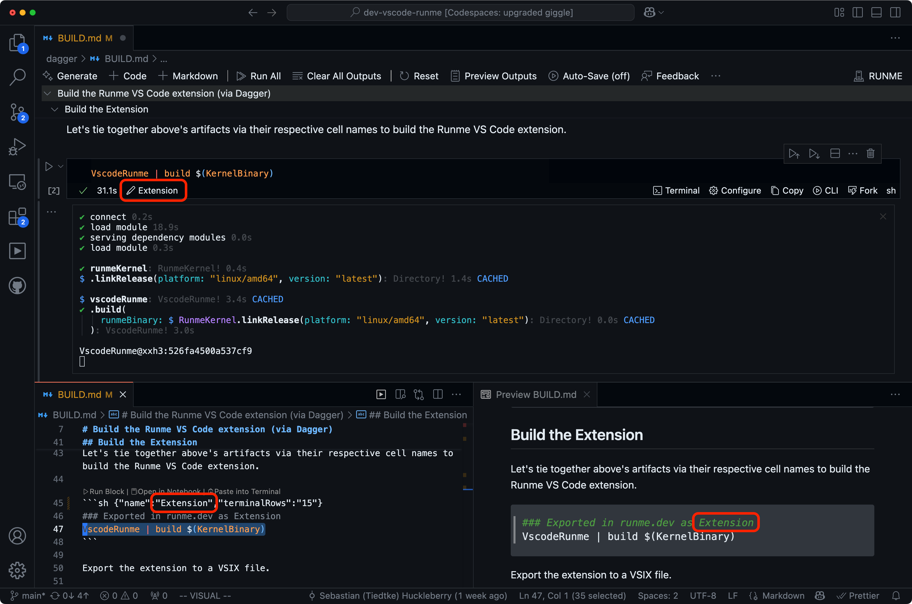
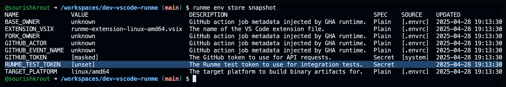
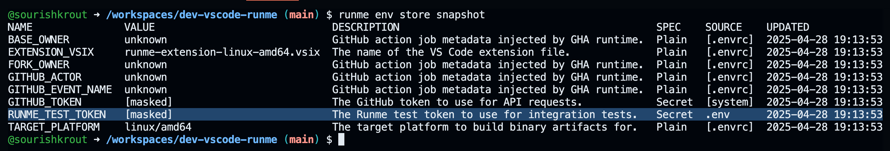
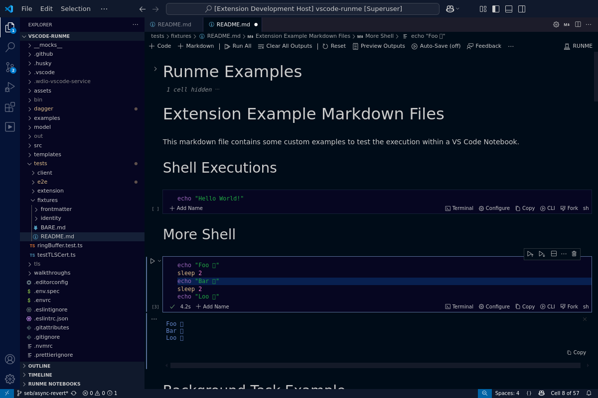

A few weeks back, the folks at Dagger released their [Container-Native Shell](https://dagger.io/blog/a-shell-for-the-container-age-introducing-dagger-shell), and it’s awesome! Leading up to the launch, the team at Stateful/Runme was invited for a sneak preview and decided to build a frontend for Dagger Shell into [Runme](https://runme.dev).

In this blog post, we'll illustrate how we're using Runme and Dagger to replace the Runme CNCF project’s organically-grown GitHub Actions ‘YAML Pipelines’ with just Nouns and Verbs right from your docs.

I will demonstrate how you can break down your YAML and Bourne-Again Shell spaghetti code into Dagger-powered, portable, and self-documenting pipeline definitions that are native to markdown. Runme stitches together the Dagger Shell scripts on the fly for execution and handles all of the environmental details, keeping your pipelines readable, portable, and executable both remotely and locally.

My name is [Sebastian Huckleberry](https://www.linkedin.com/in/sebastiantiedtke/), I am the CEO at Stateful, we make [Runme](https://runme.dev), and I'm excited to contribute this guest blog post. Let’s dive right in.

<figure>
  <video
    class="rounded-md border-solid border-2"
    autoplay=""
    loop=""
    muted=""
    playsinline=""
    controls=""
  >
    <source src="nouns-verbs-e2e.mp4" type="video/mp4" />
    <source src="nouns-verbs-e2e.webm" type="video/webm" />
  </video>
  <figcaption>
    &gt; Running the E2E integration test suite in the notebook
  </figcaption>
</figure>

Consider the following concise Dagger shell snippet. For everyday use, it’s as simple as running `$ runme run IntegrationTests` from anywhere in the project or pressing ▶️ on the cell. That's right, you **quite literally** run the docs.

<pre>
&#35;&#35;&#35; Exported in runme.dev as IntegrationTests
Extension | integration-test --runme-test-token RUNME_TEST_TOKEN | stdout
</pre>

What isn’t apparent from the Dagger Shell snippet behind the `IntegrationTests` ‘noun’ is that it won’t just execute the integration test suite; it’s an entire pipeline doing all of the following:

1. Fetches sources (Golang and TypeScript repositories)
2. Install the respective project dependencies
3. Compile all code into releaseable artifacts
4. Link them into a VS Code extension bundle
5. Then, execute the functional end-to-end test suite using headless browsers

The integration test suite runs headlessly on Linux. Linux because headless browsers require the X Virtual Frame Buffer (xvfb) to run. Without Runme fronting Dagger, the fully expanded Shell snippet runnable on any Linux system shell is:

```sh
dagger shell -c 'github.com/runmedev/vscode-runme | build $(github.com/runmedev/runme | link-release --version "latest" "linux/amd64") | integration-test | stdout'
```

While more elaborate, it’s still incredibly readable, and as a side benefit, you won’t need to clone any repositories to run the entire ‘pipeline’ successfully. Modules in Dagger are content-addressable, which means references, such as [`github.com/runmedev/vscode-runme`](http://github.com/runmedev/vscode-runme), are automatically fetched from GitHub. If you don’t have `xvfb` handy, just run the unit tests. Just be sure to change your local machine’s CPU architecture: `arm64` vs `amd64`.

```sh
dagger shell -c 'github.com/runmedev/vscode-runme | build $(github.com/runmedev/runme | link-release --version "latest" "linux/amd64") | unit-test | stdout'
```

## Runme as Frontend and UX for Dagger

Dagger handles the heavy lifting, orchestrating containers to build artifacts and apply precise caching in between, while Runme addresses the following three problems:

1. It’s hard to keep tasks and workflows consistent across various tools, such as editors, browsers, and the terminal. Everything is disconnected.
2. Setting up environments and managing config and secrets is messy, manual, and doesn’t transfer well between machines or teammates.
3. Docs are often out of sync or scattered. It’s tough to keep things clear and close to the work, even in the year 2025.

If you haven’t used Runme before, Runme runs Markdown. It's a universal task runner that understands Shells (POSIX & Dagger), Cloud resources, and Programming Languages that run under a Shell’s shebang.

<ImageWithCaption caption="Naming cells/tasks in Runme and their relationships across the notebook, markdown, and preview">
    
</ImageWithCaption>

Its flagship UX is the notebook that makes your documentation interactive. However, it integrates into both the editor and the terminal. Since it saves to Markdown, Runme won’t close the door for anyone preferring a non-interactive documentation reading experience.

## Nouns and Verbs–The Lingo to Express Pipelines

To understand Runme’s frontend role for Dagger, let's target building a releasable version of Runme’s VS Code extension. This includes building and linking:

1. The Golang-based kernel binary running inside the VS Code extension
2. The Typescript sources for the VS Code extension are bundled via webpack
3. Linking a VS Code VSIX package of all artifacts, that’s installable in any VS Code clone

We target the `ExtensionVsix` noun, which describes the VSIX as the final file format – our desired outcome. The <span style="color:magenta; font-weight:bold">Noun</span> 'nomenclature' with capitalization is intentional because the result produced is a local extension file that we can install or ship to Microsoft's VS Code marketplace.

<pre>
&#35;&#35;&#35; Exported in runme.dev as <span style="color:magenta; font-weight:bold">ExtensionVsix</span>
<span style="color:magenta">Extension</span> | <span style="color:blue">bundle</span> | <span style="color:blue">export</span> $EXTENSION_VSIX
</pre>

## Linguistics of "Dagger Sentences" in Runme

Now, while <span style="color:magenta; font-weight:bold">Nouns</span> describe Dagger artifacts (file, directory, container, etc), the Dagger functions performing operations are <span style="color:blue; font-weight:bold">verbs</span> (lowercase). If this feels reminiscent of software system design tasks, it is. It involves identifying the essential components of your domain, including nouns that represent entities and verbs that detail the related actions. Except for primarily serving comprehension in Software Design, we use the exact lingo to express Dagger pipelines.

Using Runme as a frontend, the idea is to use Dagger Shell pipes and references to decompose a complex pipeline into a series of concise **Dagger sentences** which consist of <span style="color:magenta">Nouns</span> and <span style="color:blue">verbs</span> and, conveniently, have a descriptive name (yes, another <span style="color:magenta">Noun</span>). Then, we lean on Runme’s universal task runner to generate the Dagger Shell code required to execute pipelines dynamically, where the targeted <span style="color:magenta">Noun</span> is the entry point. Too abstract? Here’s an example.

Consider the difference between the `ExtensionVsix` and `Extension` <span style="color:magenta">Nouns</span>. The latter builds (Typescript compiler) the extension, linking it with the Kernel binary:

<pre>
&#35;&#35;&#35; Exported in runme.dev as <span style="color:magenta; font-weight: bold">Extension</span>
<span style="color:magenta">VscodeRunme</span> | <span style="color:blue">build</span> $(<span style="color:magenta">KernelBinary</span>)
</pre>

Whereas `ExtensionVsix` uses pipes on `Extension` to chain bundling (create VSIX package) and exporting (write file to Dagger host’s file system), the `runme-extension-[arch].vsix` (value of `$EXTENSION_VSIX`) file artifact.

<pre>
&#35;&#35;&#35; Exported in runme.dev as <span style="color:magenta; font-weight: bold">ExtensionVsix</span>
<span style="color:magenta">Extension</span> | <span style="color:blue">bundle</span> | <span style="color:blue">export</span> $EXTENSION_VSIX
</pre>

Just like in linguistics, <span style="color:magenta">Nouns</span> can act as subjects or objects in ‘Dagger sentences’. Notice how `KernelBinary` is being passed using the Shell Expression syntax `$(...)` to make it the object of the `build` <span style="color:blue">verb</span> (the predicate in Linguistics), running the Dagger function on the subject `Extension`. Now there are also attributes (optional and positional arguments) which control the behavior of functions (aka <span style="color:blue">verbs</span>), but let’s not get carried away with the language analogies.

## Running Dagger Pipeline using Runme

If linguistics is too far from technology for you, that’s okay. The team at Stateful, including me, finds it helpful because it’s literally how natural language works. And, in my native language, German, we capitalize nouns without exception, and we often put verbs at the end of sentences.

In any case, getting an installable Runme VS Code from source locally is now trivial, running:

<pre>
$ runme run <span style="color:magenta">ExtensionVsix</span>
✔ connect 0.3s
✔ load module 1.0s
✔ serving dependency modules 0.0s
✔ load module 0.2s

✔ runmeKernel: RunmeKernel! 0.3s
$ .releaseFiles(platform: "darwin/arm64", version: "latest"): Directory! 2.3s CACHED

✔ Host.directory(path: "/Users/sourishkrout/Projects/stateful/oss/vscode-runme"): Directory! 24.5s

✔ vscodeRunme(
│ │ source: Host.directory(path: "/Users/sourishkrout/Projects/stateful/oss/vscode-runme"): Directory!
│ ): VscodeRunme! 2.9s
✔ .build(
│ │ runmeBinary: $ RunmeKernel.releaseFiles(platform: "darwin/arm64", version: "latest"): Directory! 0.0s CACHED
│ ): VscodeRunme! 1m21s
✔ .bundle: File! 1m42s
✔ .export(path: "runme-extension-darwin-arm64.vsix"): String! 0.2s

<span style="color:magenta">~/oss/vscode-runme/runme-extension-darwin-arm64.vsix</span>
</pre>

What makes all this work is [Dagger’s Type System](https://docs.dagger.io/#key-features) and the fact that execution is orchestrated in containers. This is a game-changer, not just for security and superior caching, but it also makes debugging pipelines thanks to decomposition much easier.

## Under the Runme Frontend's Hood

Under the hood, the Runme frontend will transparently transform its markdown/notebook representation into plain Dagger Shell, which, if you wanted, you could run as a Dagger Shell script in and of itself. The following script is exactly what `$ runme run ExtensionVsix` hands off to Dagger.

```
$ runme print ExtensionVsix
#!/usr/bin/env dagger shell
VscodeRunme()
{
 .
}
DAGGER_01JSPTYPXSK8RHVYTFJM6RG2NA()
{
 RunmeKernel | list-release --version latest | entries
}
KernelBinary()
{
 RunmeKernel | link-release --version latest $TARGET_PLATFORM
}
Extension()
{
 VscodeRunme | build $(KernelBinary)
}
ExtensionVsix()
{
 Extension | bundle | export $EXTENSION_VSIX
}
UnitTests()
{
 Extension | unit-test | stdout
}
IntegrationTests()
{
 Extension | integration-test --runme-test-token RUNME_TEST_TOKEN | stdout
}
GhaIntegrationTests()
{
 Extension | gha-job $BASE_OWNER $FORK_OWNER $GITHUB_ACTOR $GITHUB_EVENT_NAME \
 | integration-test --runme-test-token RUNME_TEST_TOKEN | stdout
}
DAGGER_01JSPTYPXSK8RHVYTFK08DMRQ0()
{
 Extension | integration-test --runme-test-token RUNME_TEST_TOKEN --spec "specs/githubAction.e2e.ts" | stdout
}
DAGGER_01JSPTYPXSK8RHVYTFK1VYAQMY()
{
 Extension | integration-test --debug --runme-test-token RUNME_TEST_TOKEN --spec "specs/githubAction.e2e.ts" | directory "tests/e2e/logs" | export /tmp/e2e-logs
}
ExtensionVsix
```

In contrast to the individual Dagger Shell code cell (with `--raw` flag) as follows:

````
$ runme print --raw ExtensionVsix
```
sh {"name":"ExtensionVsix"}
### Exported in runme.dev as ExtensionVsix
Extension | bundle | export $EXTENSION_VSIX
```
````

Running `ExtensionVsix` only requires a subset of all function definitions in the script above. In future versions, the team working on Runme could add features to make the script even more concise:

1. Prune unexecuted code from the script using a control flow graph
2. Optionally unnest the call graph and reduce the script to a one-liner

Now let’s discuss what it takes to achieve portability to run your pipelines anywhere.

## Transparently Configure the Environment

The challenge that fully portable pipelines face, which run both locally and remotely (e.g., GitHub, GitLab, CircleCI, etc), is ‘configuration’ and its extremely sensitive sibling, ‘secrets’. Portable container images are only half the problem because they can’t run without valid configurations. Infrastructure/hardware aside, what makes a working ‘Environment’ is both.

To successfully run Runme's delivery pipeline, we need to know the following:

- The host’s OS
- The CPU architecture

These are necessary so that Golang builds the correct binaries. It’s not unusual to run Dagger in OCI container runtimes on heterogeneous environments (e.g., Linux via Docker Desktop on macOS or Windows). Getting OS and architecture right is easier said than done if your team is on macOS and transitioning from `x64` to `ARM`, while all of CI/CD is on `x64` Linux. Moreover, tests won’t complete without the following values:

- GitHub API calls are aggressively throttled unless you provide an authentication token.
- Runme’s e2e integration suite requires an Access Token to dispatch a GHA workflow.
- Dynamically include the OS/arch combo into the extension’s file name.
- GitHub Actions job metadata to disable specific tests on external Pull Requests.

The team building Runme came up with a solution and its 100% compatible with Dagger's Shell.

## Pipeline Environment Declarations

Enter Runme’s [Owl Store](https://runme.dev/blog/typed-env-vars) with [DotEnv/Direnv](https://docs.runme.dev/configuration/dotenv-direnv) integrations. The way this works is that you provide an [`.env.spec`](https://github.com/runmedev/vscode-runme/blob/16035ce0da072a6ae4e2e69a00569cb1a25b5cdc/.env.spec) that specifies a valid Environment.

```
EXTENSION_VSIX="The name of the VS Code extension file." # Plain!
GITHUB_TOKEN="The GitHub token to use for API requests." # Secret
RUNME_TEST_TOKEN="The Runme test token to use for integration tests." # Secret
TARGET_PLATFORM="The target platform to build binary artifacts for." # Plain!

BASE_OWNER="GitHub action job metadata injected by GHA runtime." # Plain!
FORK_OWNER="GitHub action job metadata injected by GHA runtime." # Plain!
GITHUB_ACTOR="GitHub action job metadata injected by GHA runtime." # Plain!
GITHUB_EVENT_NAME="GitHub action job metadata injected by GHA runtime." # Plain!
```

## Dynamic Environment Resolution

And, a matching [`.envrc`](https://github.com/runmedev/vscode-runme/blob/16035ce0da072a6ae4e2e69a00569cb1a25b5cdc/.env.spec) file which, once authorized (`direnv allow`), will populate the environment. If this pipeline ran behind a firewall, we would likely experience a Cambrian Explosion of key/value pairs (often only discovered via Slack spelunking). However, only having a few variables is great for illustration:

```
export TARGET_PLATFORM="$(go env GOOS)/$(go env GOARCH)"
export EXTENSION_VSIX="runme-extension-${TARGET_PLATFORM/\//-}.vsix"
export GITHUB_TOKEN=$(gh auth token)
export GOAWAY=1

export BASE_OWNER=${BASE_OWNER:-unknown}
export FORK_OWNER=${FORK_OWNER:-unknown}
export GITHUB_ACTOR=${GITHUB_ACTOR:-unknown}
export GITHUB_EVENT_NAME=${GITHUB_EVENT_NAME:-unknown}
```

Runme, as Dagger’s frontend, will resolve the Environment when a session is first created, typically at startup. Running pipelines locally, it’s simple to check if they are on the right track:

<ImageWithCaption caption="The environment is invalid and will cause the pipeline to fail">
    
</ImageWithCaption>

The value `unknown` is expected for GHA metadata when running outside of GitHub Actions. However, `RUNME_TEST_TOKEN` is unset, which will cause integration tests to fail.

<ImageWithCaption caption="A valid environment will make the pipeline succeed">
    
</ImageWithCaption>

Fixing the token locally is easy. Add the static value (hiding .env from readers for obvious reasons) into an `.env` or `.env.local` file and reset the session.

## Orchestrating the Pipeline with GitHub Actions

At Stateful/Runme, we are still using GitHub Actions to [run the pipeline](https://github.com/runmedev/vscode-runme/blob/16035ce0da072a6ae4e2e69a00569cb1a25b5cdc/.github/workflows/pipeline.yml#L27-L49), which comes with a feature to manage secrets. GitHub Action’s role here is limited to scheduling and orchestration. If you ask me, I would rather use the Owl Store and Workload Identity to manage configurations and secrets for Environments. However, one thing at a time.

```
[...]
- name: Install direnv
 run: curl -fsSL https://direnv.net/install.sh | bash
- name: Authorize direnv
 run: direnv allow && direnv export bash
- name: Setup Dagger
 uses: dagger/dagger-for-github@8.0.0
 with:
 version: "latest"
 verb: core
 args: "engine local-cache"
- name: 🧪 Run Unit + Integration Pipeline
 uses: stateful/runme-action@v2
 with:
 workflows: test:pipeline
 env:
 DAGGER_CLOUD_TOKEN: ${{ secrets.DAGGER_CLOUD_TOKEN }}
 GITHUB_TOKEN: ${{ secrets.GITHUB_TOKEN }}
 RUNME_TEST_TOKEN: ${{ secrets.RUNME_TEST_TOKEN }}
 # gha job metadata
 BASE_OWNER: ${{ github.repository_owner }}
 FORK_OWNER: ${{ github.event.pull_request.head.repo.owner.login }}
 GITHUB_ACTOR: ${{ github.actor }}
 GITHUB_EVENT_NAME: ${{ github.event_name }}
[...]
```

Looking at the stripped down YAML, this workflow runs a cell/task named `test:pipeline`. It's essentially an alias for running our two testing nouns (i.e., `$ runme run UnitTests GhaIntegrationTests`). The latter additionally [passes GitHub Actions metadata](https://github.com/runmedev/vscode-runme/blob/main/dagger/BUILD.md#testing) (toggling checks on PRs) into the integration test suite.

## Add a Window Into the E2E Integration Test Suite

To further illustrate the "Nouns and Verbs" concept, let’s add a new <span style="color:magenta; font-weight: bold">Noun</span> to, for example, grab the screenshots taken during tests. Add a new `IntegrationTestScreenshots` that gets hold off the directory containing the WebDriver screenshots after the test suite has run.

<pre>
&#35;&#35;&#35; Exported in runme.dev as <span style="color:magenta; font-weight: bold">IntegrationTestScreenshots</span>
<span style="color:magenta">Extension</span> | <span style="color:blue">integration-test</span> --runme-test-token RUNME_TEST_TOKEN | <span style="color:blue">directory</span> "logs/screenshots" | <span style="color:blue">export</span> /tmp/e2e-screenshots
</pre>

How exhilarating. Now we have a window into the end-to-end test suite if something were to happen. Here’s one screenshot from one of my recent test suite runs:

<ImageWithCaption caption="A window into the E2E integration test suite">
    
</ImageWithCaption>

While 15 minutes might sound long, at Stateful/Runme, we wouldn’t trade the world for the confidence we gain from the end-to-end test suite. But when it runs and fails, it had better identify a real bug that was introduced, rather than failing due to a side effect in the environment. Dagger's superpower besides caching is that it's simple to run the same pipeline locally, on a VM, or a Codespaces instance to both debug and rule out GitHub Actions being under the weather.

If we added the debug flag to `Extension | integration-test --debug...`, we could take advantage of Dagger’s cache even if the tests fail. This is tremendously useful to check screenshots or logs without the delay of re-running the test suite.

That being said, I hope you agree that this simple example illustrates how Dagger’s powerful primitives can be leveraged to maintain a first-class Developer Experience, which is both portable, documentation-native, and quick to turn around. That’s a big win compared to legacy CI/CD best practices, where you can’t have all three but are forced to trade off amongst them. Exactly that is what got us at Stateful first excited about Dagger. Now here we are building a Dagger Shell frontend into Runme.

## Documentation as Software Factory’s Truth

The build and tests pipelines aren't the end of it. At Stateful we're excited to further reduce coupling of the CNCF Runme project with any single CI/CD provider, such as GitHub Actions, while maintaining a high bar for developer experience in Runme’s Software Factory. With Runme as a Dagger Shell frontend, the source of truth is always your documentation.

The team's happy to have derisked Runme's migration to Dagger-powered CI/CD by tackling the bulkiest workflows first:

1. Building all Artifacts, and
2. Running Unit and Integration Tests

Now that we have the Delivery 'Nouns and Verbs' in their respective Dagger modules, it’s a matter of stringing them together differently depending on what a pipeline's goal is. Next up for the Runme project are three concrete projects:

1. Optimize file system dependencies (legacy from pre-container) in E2E tests to reduce inherent brittleness, resulting in fewer retries due to flakes.
2. Run goreleaser in the Dagger pipeline to release official builds for Runme CLI/kernel.
3. Migrate the [release pipeline](https://github.com/runmedev/vscode-runme/actions/runs/14499512930) to test, build extensions for the entire OS and architecture matrix, and upload artifacts to OpenVSX and the VS Code Marketplace.

## What’s Next

Thank you for taking a break from the AI news buzz to delve into what we're up to with Runme and Dagger. I am both incredibly grateful for the opportunity to guest contribute to Dagger's blog and love everything about the ecosystem Dagger is building. If you have any questions, feel free to find Sebastian on [Runme's Discord server](https://discord.gg/runme) (aka 'sourishkrout') or [create a GitHub issue](https://github.com/runmedev/runme/issues/new).

By the way, it's super easy to get started with Dagger Shell inside of Runme, just create a file, e.g., called [`shell.dag`](https://github.com/runmedev/vscode-runme/blob/main/dagger/notebook/shell.dag), where the Runme extension will auto-select Dagger Shell as your preferred notebook shell.

Bye-bye for now.
